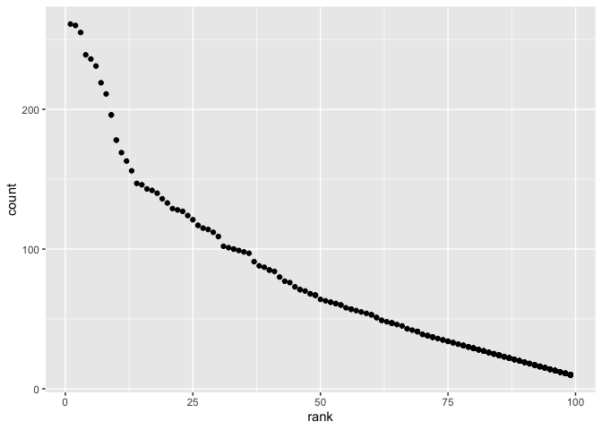

p8105\_HW2
================
Yongzi Yu yy3103

I’m an R Markdown document!

``` r
library(tidyverse)
```

    ## ── Attaching packages ─────────────────────────────────────── tidyverse 1.3.1 ──

    ## ✓ ggplot2 3.3.4     ✓ purrr   0.3.4
    ## ✓ tibble  3.1.2     ✓ dplyr   1.0.7
    ## ✓ tidyr   1.1.3     ✓ stringr 1.4.0
    ## ✓ readr   1.4.0     ✓ forcats 0.5.1

    ## ── Conflicts ────────────────────────────────────────── tidyverse_conflicts() ──
    ## x dplyr::filter() masks stats::filter()
    ## x dplyr::lag()    masks stats::lag()

``` r
library(tidyr)
library(readxl)
library(Hmisc)
```

    ## Loading required package: lattice

    ## Loading required package: survival

    ## Loading required package: Formula

    ## 
    ## Attaching package: 'Hmisc'

    ## The following objects are masked from 'package:dplyr':
    ## 
    ##     src, summarize

    ## The following objects are masked from 'package:base':
    ## 
    ##     format.pval, units

``` r
library(dplyr)
```

# Problem1

``` r
#load data
trash_data= 
  read_excel("./data/Trash_new.xlsx",skip=1,sheet=1)%>%
  janitor::clean_names() %>%
  select(dumpster:homes_powered)%>%
  drop_na(dumpster)%>%  #omit rows that not have dumpster data
  drop_na(month)%>%  #omit Total 
  mutate(sports_balls=round(sports_balls)) #round int
```

    ## New names:
    ## * `` -> ...15
    ## * `` -> ...16
    ## * `` -> ...17

``` r
pre_2019=
  read_excel("./data/Trash_new.xlsx",skip=1,sheet=7)%>%
  janitor::clean_names() %>%
  drop_na()%>% #omit rows that not have data
  mutate(year=2019)

pre_2018=
  read_excel("./data/Trash_new.xlsx",skip=1,sheet=8)%>%
  janitor::clean_names() %>%
  drop_na()%>% #omit rows that not have data
  mutate(year=2018)

pre_1819=
  full_join(pre_2018,pre_2019) %>%
  mutate(month=month.name[month]) #convert month # to a character
```

    ## Joining, by = c("month", "total", "year")

-   For Mr.Trash Wheel Sheet, there are 486 rows and 14 columns. Key
    variables are dumpster, month, year, date, weight\_tons,
    volume\_cubic\_yards, plastic\_bottles, polystyrene,
    cigarette\_butts, glass\_bottles, grocery\_bags, chip\_bags,
    sports\_balls, homes\_powered.  
-   For precipitation, there are 24 rows and 3 columns.  
    Key variables are dumpster, month, year, date, weight\_tons,
    volume\_cubic\_yards, plastic\_bottles, polystyrene,
    cigarette\_butts, glass\_bottles, grocery\_bags, chip\_bags,
    sports\_balls, homes\_powered.  
-   Total precipitation in 2018 is 70.33. Median number of sports balls
    in a dumpster in 2019 is 9.

# Problem2

``` r
pols= 
  read_csv("./data/pols_month.csv") %>%
  janitor::clean_names() %>%
  separate(mon, c("year", "month","day"), sep="-") %>% #separate value
  mutate(month=month.name[(as.double(month))]) %>% #change month
  mutate(president=prez_gop+prez_dem) %>% #add president
  select(-prez_gop,-prez_dem,-day)  #remove col 
```

    ## 
    ## ── Column specification ────────────────────────────────────────────────────────
    ## cols(
    ##   mon = col_date(format = ""),
    ##   prez_gop = col_double(),
    ##   gov_gop = col_double(),
    ##   sen_gop = col_double(),
    ##   rep_gop = col_double(),
    ##   prez_dem = col_double(),
    ##   gov_dem = col_double(),
    ##   sen_dem = col_double(),
    ##   rep_dem = col_double()
    ## )

``` r
snp=
  read_csv("./data/snp.csv")%>%
  janitor::clean_names() %>%
  separate(date, c("month","day","year"), sep="/") %>% #separate value
  mutate(month=month.name[(as.double(month))]) %>% #change month
  select(-day)%>%
  arrange(year,month)
```

    ## 
    ## ── Column specification ────────────────────────────────────────────────────────
    ## cols(
    ##   date = col_character(),
    ##   close = col_double()
    ## )

``` r
unemployment=
  read_csv("./data/unemployment.csv")%>%
  pivot_longer(
    Jan:Dec,
    names_to = "month", 
    values_to = "unemployment_rate")%>% #wide to long format
  mutate(month=month.name[as.double(match(month,month.abb))]) %>%
  mutate(Year=as.character(Year))%>% #change month
  janitor::clean_names()
```

    ## 
    ## ── Column specification ────────────────────────────────────────────────────────
    ## cols(
    ##   Year = col_double(),
    ##   Jan = col_double(),
    ##   Feb = col_double(),
    ##   Mar = col_double(),
    ##   Apr = col_double(),
    ##   May = col_double(),
    ##   Jun = col_double(),
    ##   Jul = col_double(),
    ##   Aug = col_double(),
    ##   Sep = col_double(),
    ##   Oct = col_double(),
    ##   Nov = col_double(),
    ##   Dec = col_double()
    ## )

``` r
#join data sets
pols_snp=
  left_join(pols,snp,by=c('year','month')) #join snp into pols

pols_snp_unempl=
  left_join(pols_snp,unemployment,by=c('year','month'))#join snp and unemployment into pols
```

-   For pols, there are 822 rows and 9 columns in the joined data set.
    The range of year is 1947, 2015. Key variables are year, month,
    gov\_gop, sen\_gop, rep\_gop, gov\_dem, sen\_dem, rep\_dem,
    president.

-   For snp, there are 787 rows and 3 columns in the joined data set.
    The range of year is 1950, 2015. Key variables are month, year,
    close.

-   For unemployment, there are 816 rows and 3 columns in the joined
    data set. The range of year is 1948, 2015. Key variables are year,
    month, unemployment\_rate.

-   there are 822 rows and 11 columns in the joined data set. The range
    of year is 1947, 2015. Key variables are year, month, gov\_gop,
    sen\_gop, rep\_gop, gov\_dem, sen\_dem, rep\_dem, president, close,
    unemployment\_rate.

# Problem 3

``` r
names= 
  read_csv("./data/Popular_Baby_Names.csv")
```

    ## 
    ## ── Column specification ────────────────────────────────────────────────────────
    ## cols(
    ##   `Year of Birth` = col_double(),
    ##   Gender = col_character(),
    ##   Ethnicity = col_character(),
    ##   `Child's First Name` = col_character(),
    ##   Count = col_double(),
    ##   Rank = col_double()
    ## )

``` r
#remove duplicates
names=
  names[!duplicated(names), ]

#date clean: 1.make names consistent like 'Olivia' 2.make variable ethnicity consistent
names=
  names %>%
  janitor::clean_names() %>%
  mutate(
    childs_first_name=capitalize(str_to_lower(childs_first_name)))%>%
  mutate(
    ethnicity = recode(ethnicity,
    'ASIAN AND PACI' ='ASIAN AND PACIFIC ISLANDER', 
    'WHITE NON HISP' = 'WHITE NON HISPANIC',
    'BLACK NON HISP' = 'BLACK NON HISPANIC')
  )

#show most popular name in female over time
Olivia=
  names %>% 
  filter(gender == "FEMALE")%>% 
  filter(childs_first_name == "Olivia")%>% 
  select(ethnicity,everything(),-gender,-count,-childs_first_name)%>% 
  arrange(ethnicity,year_of_birth)%>% 
  pivot_wider(
    ethnicity:rank,
    names_from= "year_of_birth",
    values_from= "rank"
  )
knitr::kable(Olivia)
```

| ethnicity                  | 2011 | 2012 | 2013 | 2014 | 2015 | 2016 |
|:---------------------------|-----:|-----:|-----:|-----:|-----:|-----:|
| ASIAN AND PACIFIC ISLANDER |    4 |    3 |    3 |    1 |    1 |    1 |
| BLACK NON HISPANIC         |   10 |    8 |    6 |    8 |    4 |    8 |
| HISPANIC                   |   18 |   22 |   22 |   16 |   16 |   13 |
| WHITE NON HISPANIC         |    2 |    4 |    1 |    1 |    1 |    1 |

``` r
#show most popular name in male over time
Male=
  names %>% 
  filter(gender == "MALE")%>% 
  filter(rank == "1")%>% 
  select(ethnicity,childs_first_name,everything(),-gender,-count,-rank)%>% 
  arrange(ethnicity,year_of_birth)%>%
  pivot_wider(
    ethnicity:childs_first_name,
    names_from= "year_of_birth",
    values_from= "childs_first_name"
  )
knitr::kable(Male)
```

| ethnicity                  | 2011    | 2012   | 2013   | 2014   | 2015   | 2016   |
|:---------------------------|:--------|:-------|:-------|:-------|:-------|:-------|
| ASIAN AND PACIFIC ISLANDER | Ethan   | Ryan   | Jayden | Jayden | Jayden | Ethan  |
| BLACK NON HISPANIC         | Jayden  | Jayden | Ethan  | Ethan  | Noah   | Noah   |
| HISPANIC                   | Jayden  | Jayden | Jayden | Liam   | Liam   | Liam   |
| WHITE NON HISPANIC         | Michael | Joseph | David  | Joseph | David  | Joseph |

``` r
#draw plot

names_plot = 
  names %>% 
  janitor::clean_names() %>% 
  filter(year_of_birth=='2016',gender=='MALE',ethnicity == 'WHITE NON HISPANIC')


ggplot(names_plot,aes(rank,count))+geom_point()
```

<!-- -->
